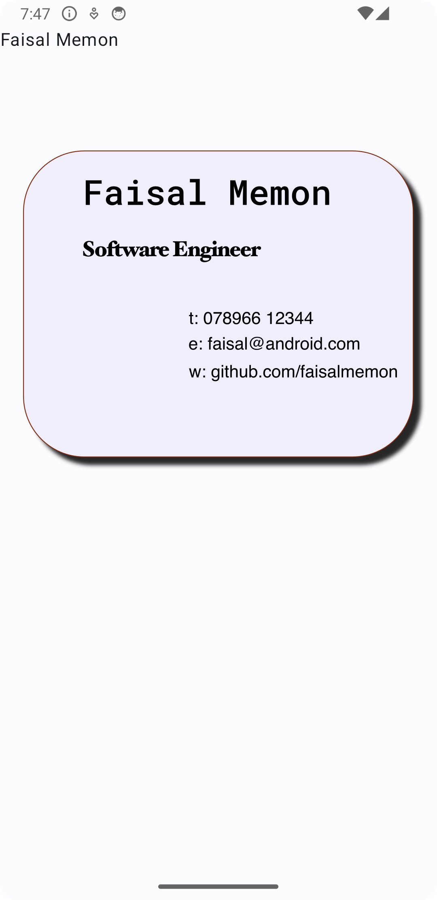
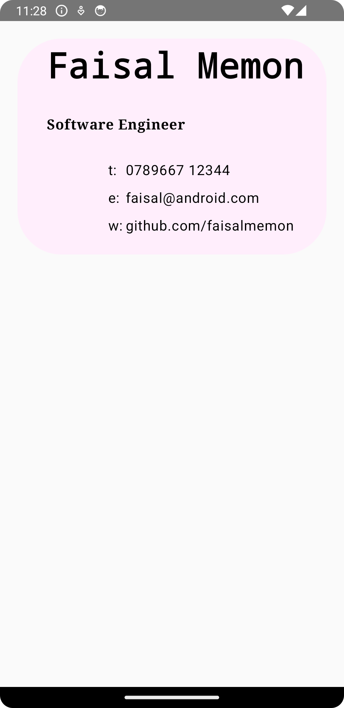

# README

This project is an attempt to do a static business card app.

I didn't quite get there but had a reasonable solution.  The good thing about this 
project was you already had enough grounding to explore new techniques in 
JetPack Compose off StackOverflow or YouTube.  I think this was the real point 
of the exercise.

The design I was aiming for was from taking a emulator screenshot and then
doing an inkscape overlay:

## Design

## Implementation

